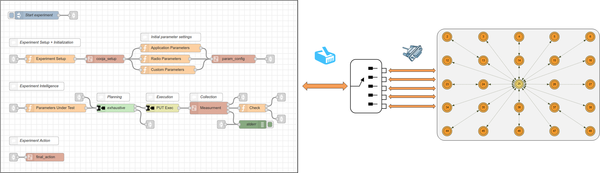
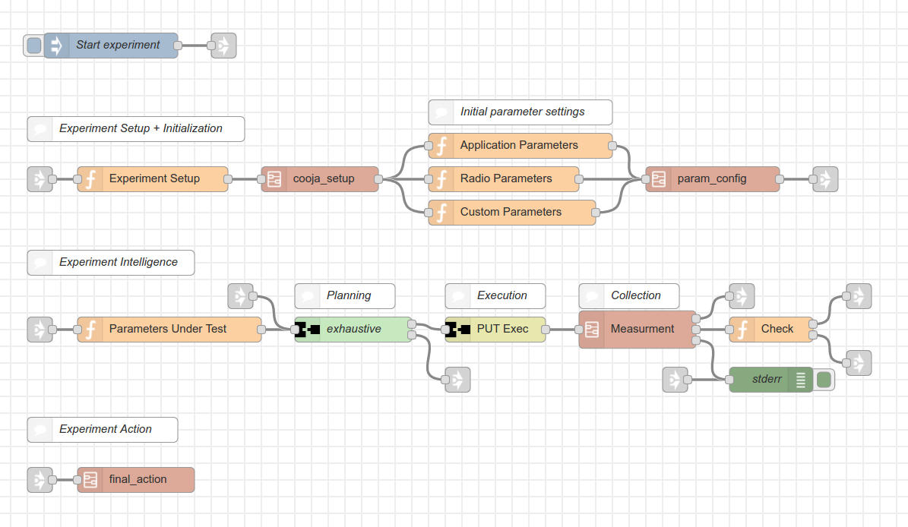
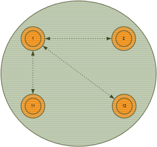

# Measurement collection using Cooja network simulator and node-red framework

When it comes to understanding the operation of wireless networks and building the solutions, network simulators play a vital role first because they can be easily setup and produce valuable results in a short amount of time and second they can simulate the real world very well and complements experimental results for building solutions. In this part of the Intelligence Framework, a collection component using node-red is built for the Cooja network simulator inside [Contiki](http://www.contiki-os.org/).

Contiki is an open source Operating System (OS) for constrained Wireless Sensor Networks (WSN) mainly aimed at robustness and power efficiency. As a core part of the Contiki system, the Cooja network simulator aids in the development process of wireless sensor solutions. Cooja allows large and small networks of Contiki motes to be simulated at software level and also emulated at hardware level which allows precise inspection of the system behavior. Similar to other applications, the performance of the Cooja simulator depends on the processing power of the machine and usually the simulation gets very slow when large number of Contiki motes are being simulated.

## Communication between Cooja and node-red

Leaving the details for later, the basic idea of a Cooja measurement collector is to set design parameters on the Cooja network simulator and retrieve measurement results for performance calculations. Therefore, within the measurement collection, the communication between Cooja and node-red makes the core part. Cooja as a service provider exposes different communication methods to the outside world out of which serial communication is used in our implementation. In this method, the Cooja simulator creates a pseudo terminal device for each of the Contiki motes and communication to individual motes goes through the serial interface. The serial protocol used on the node-red front-end is WiSHFUL compliant and a Contiki firmware must support the WiSHFUL protocol in order to make successful end-to-end communication. Moreover, multiple configurations or multiple measurements can be requested from the node-red side all at once and each request is forwarded/multiplexed into individual motes. Afterwards, responses from the individual motes are collected at the multiplexer unit and send back to node-red as a single message response. Figure 1 shows the multiplexer unit connecting the node-red to the Cooja simulator.



*Figure 1. Node-red, Multiplexer and Cooja simulator*

The multiplexer unit is developed as a C program and the source code as well as the makefile to compile the program is located under *pts_mux* directory.


## Node-red collection flow

Cooja sitting at the back end and pts multiplexer providing the gateway service, the node-red front-end automates parameter configuration and collection of measurement results. The node-red collection flow, shown in Figure 2, is a generic flow applicable for multiple use cases.



*Figure 2. Generic node-red flow for configuring parameters and collecting results*

The generic flow is composed of three major parts; experiment setup/initialization, experiment intelligence and experiment action. In the first phase, the Cooja network simulator is set up and started with a given application. As of this moment, the Cooja network simulator is running in an unknown state and initializing parameters at different levels (*application*, *radio*, *custom*) will bring the wireless network back to a default state.

In the second phase, the experiment intelligence starts by selecting the Parameters Under Test (PUT). These are parameters that we want to tweak and see their performance on the running application. Next, an exhaustive planner iteratively provides the design parameters that are executed and result collected in the consecutive blocks. Finally, a simply check reasoning block decides whether exhaustive planning is finished or needs to be triggered for the next iteration.

In the last phase, a final action is executed which can be as complex as a detailed mathematical analysis on the application performance or a very simple email notification signaling the end of the experiment.


## Installation

So, how do we create a fully functional Cooja measurement collector?

First and foremost, the Contiki/Cooja network simulator must be installed and become ready for experimentation. The easiest way to achieve this is by using a virtual machine [image](http://www.contiki-os.org/start.html) having all components pre-installed. However fast and simple this approach is, it also has performance limitation and installing directly on the host machine might be a preferred [approach](https://github.ugent.be/IBCN-mobile/contiki) if performance is the limiting factor.

Next, the node-red front end is configured by installing two programs: a [node.js](https://nodejs.org/) JavaScript runtime engine and a [node-red](https://nodered.org/) framework. For the installation procedure, please use the official [tutorial](https://nodered.org/docs/getting-started/installation) since the two programs are actively developed.

After installing the Cooja network simulator and the node-red front-end, the pts multiplexer is installed by compiling the program inside the pts_mux directory and placing it to a local system path.
```bash
cd pts_mux
make
sudo cp pts_mux /usr/local/bin
```

Finally, all supporting node-red components are installed into the node-red local path.
```bash
mkdir -p ~/.node-red/node_modules
cp -r node-red-wishful ~/.node-red/node_modules/
```


## Proof of concept

So far we have discussed the operation of the measurement collection tool and the procedure to install it. Now let us use this tool to measure a path loss coefficient and a reference path loss of a typical WSN. The path loss coefficient estimates the level of propagation loss the Wireless medium is experiencing whereas the reference path loss indicates the path loss at a distance of 1m from a source. The WSN that we want to investigate is made up of three source nodes (IDs = 2, 11, 12) sending periodic messages to a single sink node (ID = 1). Figure 3, shows the topology of the WSN.



*Figure 3. WSN made up of three source nodes and one sink node*

Every time a source node sends a packet, the sink node stores an aggregate Received Signal Strength Indicator (RSSI) and the amount of packets processed. This will give an average RSSI value over a period of time. The node-red front-end then collects all average RSSI values from the sink node for every txPower parameters defined inside PUT. In sum, txPower is configured on each source node and the average RSSI is collected at the sink node. At the end of the simulation, node-red collects N datasets equal to the number source nodes. Finally, the path loss coefficient and the reference path loss are calculated by using the [Log-distance path loss](https://en.wikipedia.org/wiki/Log-distance_path_loss_model) model shown below

```
PL = PL0 + n*x
```

Where

* PL = Path loss between a source and a sink
* PL0 = Reference path loss at a distance of 1m from a source
* n = Path loss coefficient
* x = 10*log(distance between source and sink)

#### Note
In order to repeat the proof of concept discussed so far, you need a node-red [flow](flow_PL.json) and a Contiki [firmware](single-hop_WSN.rm090) using a [single-hop](single-hop_WSN.c) WSN application.


## Contact

michael.mehari@ugent.be


