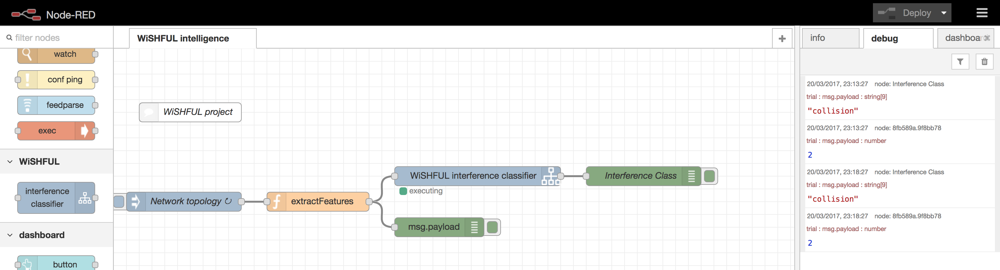

# Interference classification using Matlab and node-red


## Matlab


```Matlab
DEBUG = false;
RECORDING = false;
FILE_RECORDING=false;
USE_DEBUG_TOPOLOGY= false;
USE_NEW_TOPOLOGY=true;
USE_LBEB = true;
PSEUDO_TDMA=false;
SLOTS_TO_PLOT=intmax;

repetitions = 10;

```
## Communication between Matlab and node-red

The joint use of Matlab and node-red permits to run interference classification as part of a node-red flow. The estimation of the intereference class can be used for taking different actions, depending on the reason that was the cause of reduced performance.




*Figure 1. WiSHFUL node-red module for interference classification *


## Contact

pierluigi.gallo@unipa.it


