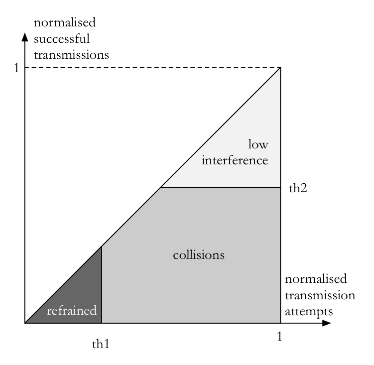
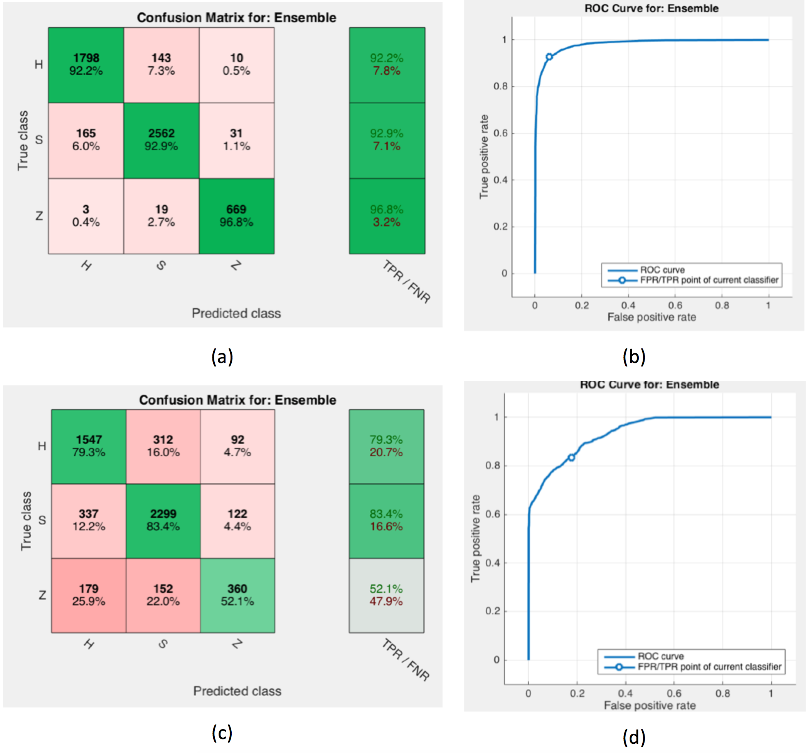

# Interference classification using Matlab and node-red


This intelligence module recognizes the presence of hidden and exposed nodes in high-density scenarios. It is well known that in case of high-density deployments, WiFi networks suffer from serious performance impairments due to hidden and exposed nodes, belonging to overlapping BSSs (OBSSs) that interfere each other. In dense environments, pathological topologies with hidden and exposed nodes are more probable to occur than in sparse wireless networks.




*Figure 1. the mapping between the three classes of the interference classification and performance figures (transmission attempts and successful transmissions)*

##Distributed and centralized intelligence
This showcase uses a twofold approach for recognizing performance impairments due to interference, which have their specific data collection modules: the centralized and the distributed approaches, whose only difference resides in the used features for the interference classification. In the distributed case we feed the classifier with busy/idle data while in the centralized case we provide topological information.
In fact, the advanced detection capability is implemented as a classifier both in the distributed and in the centralized cases. The classifier is trained with supervised learning and is able to predict interference conditions experienced by wireless nodes. 
To have comparable results we operate normalization and consider in output the throughput over the offered traffic. 
 
This normalization works also for nodes that have heterogeneous traffic requirements, despite in our simplified scenario we assume all nodes with saturated traffic.
 
###Data collection module for the distributed approach
In the distributed approach the classifier uses low-level observations given by busy and idle traces, taken using WiSHFUL UPIs. These traces are taken locally on the nodes, then values taken in a specific time window are summarized in numerical busy-idle features as follows. 

First, the distributed data collection module computes the cdf (cumulative distribution function) of buys/idle durations, then it reads the cdf in specific points corresponding to pre-defined percentiles, as shown in Figure. In our showcase we sample the cdf at the 50th, 90th and 100th percentile. 
Feature space design for the distributed approach
For the distributed approach we used raw data formatted as follows:
 
For the sake of simplification, we assume that nodes send frames with the same size, whose transmission time is 1ms. Despite it is unrealistic to have homogeneous-sized frames, it is not difficult to extend our results to frames of any length. In absence of exogenous sources of interference, durations of busy time are due to transmissions, therefore their length is exactly long as the duration of frame transmission. Busy intervals become longer than the transmission duration in case of collisions. In fact, when one node receives more than one frame concurrently, it results in a collision and in general the colliding frames are not aligned in case of hidden nodes. Moreover, several collisions can occur in a row, therefore busy intervals become longer and longer. In the case shown in figure the busy time is till 16 times longer than the frame duration. Busy durations that are one hundred times longer than the frame duration are possible. This explains the importance of this feature in predicting node performance due to interference. Analogous considerations are valid for idle durations. 
Nodes are able to distinguish interference conditions due to high-density from weak signals with low SNR, and take the corresponding action. This distinction is made possible because hidden nodes and flow in the middle have specific recognizable ‘fingerprinting’ in busy-idle traces.

###Feature space design for the centralized approach
For the centralized approach we used raw data formatted as  .
In facts, interference depends on network topology and we used the number of transmitting nodes at one hop and at two hops as relevant feature to model interference. In this case, the numbers of nodes at one hop, as well as their unique identifiers are sent to the global controller, reporting also the MAC addresses of heard nodes. This intelligent module assemble contributions and computes the whole network topology by obtaining the adjacency matrix A. Given the set V of wireless nodes, which are the vertices of the graph, the adjacency matrix is a square | V | × | V | matrix whose generic element aij is one when node i listens (and is listened from) j, and zero otherwise. The diagonal elements of the matrix are all zero, since nodes have not self-loops. 
Given the adjacency matrix the module computes the number of two-hops neighbors for each node. This is easily obtained from G^2 – G, where G^2 is the square of the graph G. These two observations, namely the numbers of one-hop and two-hops neighbors permit to run a predictive analysis about performance, under the assumption of all nodes offer saturated traffic.

## Matlab&reg; scripts
The matlab-script folder contains few scripts for creating pre-defined and random topology and simulating CSMA-based wireless networks.
These script permits to log and save performance figure.


### Run the Matlab&reg; script
To created the graph and run the simulation launch

```
high_density_one_shot
```
Since the topology is random, with default parameters and an initial coverage radius of 80 meters, it may happen that the graph is not connected, which immediately terminates the script. In such a case, the message `the graph is not connected!!!` is reported and the script should be launched again.

### Configuration parameters
The matlab script contains few self-explanatory configuration parameters that enable debugging, file recording, etc.

`USE_DEBUG_TOPOLOGY` permits to choose if a pre-defined chain topology that contains hidden nodes has to be used.

`USE_NEW_TOPOLOGY` indicates if a new Euclidean Random Graph has to be created or it will be used the previous topology.
By default it is created a network with 30 nodes an a random topology with nodes uniformly distributed on a square.

```Matlab
DEBUG = false;
RECORDING = false;
FILE_RECORDING=false;
USE_DEBUG_TOPOLOGY= false;
USE_NEW_TOPOLOGY=true;
...
repetitions = 10;
```
The script cycles over increasing coverage radius. The network density is changed by increasing the coverage radius using values indicated in the following array.

```
radius_vect = [80,90,100,110,120,150,200,300,500];
```
### Results
When the script ends, it gives instructions on how to train a classification model.

Classification results aim to evaluate the efficacy of recognition capabilities, both in centralized and distributed cases.
To present the performance evaluation of interference classification we use confusion matrices. These report the number of elements and percentages of nodes that belong to the true classes H, S, and Z in rows (hard, soft, and zero interference) and fall within the corresponding predicted classes in columns. For example, in subfigure a it results that 1951 observations were in total affected by true hard interference. The classification algorithm was able to rightly predict the right class H in 92.2% of cases (the true positive rate TPR), while in 7.8% it was wrong (the false negative rate FNR). In facts, 143 observations were classified as S (7% of cases) and 10 as Z (0.1% of cases), even if they belonged to the H class. This means that the mistaken classification of hard interference to zero interference is quite improbable, while there is a residual but significant probability to be confused with soft interference. The same considerations hold for the S and Z rows.
Results in subfigure a and b are related to decentralized intelligence that observes busy/idle traces. This approach brings to 93.1% of accuracy. In subfigure c and d we use centralized topological information exploited by the global controller and resulting in 77.9% of accuracy. Poorer accuracy in the centralized approach may appear counterintuitive, but can be explained by the limited information provided, composed only on topological aspects. For the sake of completeness, despite not relevant for this showcase, we also trained the centralized classifier with all the described features, obtaining 96% of accuracy.
In subfigures b-d there are shown the receiver operating characteristics (ROCs). These diagrams consider the performance of a binary classifier as its discrimination threshold is varied. In our case the classifier is not binary, therefore we assimilated it to binary by considering two classes: the hard interference class and another class containing soft and zero interference. These curves are obtained by plotting the true positive rate (TPR, or the probability of detection) against the false positive rate (FPR, or probability of false alarm) at various threshold settings. 



*Figure 1. WiSHFUL node-red module for interference classification *

## Communication between Matlab&reg; and node-red

The joint use of Matlab and node-red permits to run interference classification as part of a node-red flow. The estimation of the intereference class can be used for taking different actions, depending on the reason that was the cause of reduced performance.

Under the WiSHFUL group there is the interference classification component. Given the values of the features in input, it returns the interference classification in output within the set "no interference", "refrained", "collision".


*Figure 1. WiSHFUL node-red module for interference classification *

The integration between our Matlab&reg; scripts and node-red will be updated soon, please stay tuned.


## Contact

pierluigi.gallo@unipa.it


